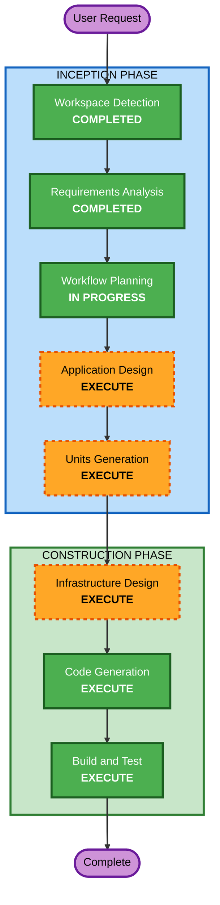

# Execution Plan

## Detailed Analysis Summary

### Change Impact Assessment
- **User-facing changes**: Yes - 新規 TODO Web アプリの構築
- **Structural changes**: Yes - 全コンポーネント新規作成（Frontend, Backend, Infrastructure）
- **Data model changes**: Yes - DynamoDB テーブル新規設計
- **API changes**: Yes - REST API 5 エンドポイント新規作成
- **NFR impact**: No - 基本的な TODO CRUD、特別な NFR 要件なし

### Risk Assessment
- **Risk Level**: Low
- **Rollback Complexity**: Easy（Greenfield、既存システムへの影響なし）
- **Testing Complexity**: Simple（基本 CRUD のみ）

## Workflow Visualization



### Text Alternative
```
Phase 1: INCEPTION
  - Stage 1: Workspace Detection (COMPLETED)
  - Stage 2: Requirements Analysis (COMPLETED)
  - Stage 3: Workflow Planning (IN PROGRESS)
  - Stage 4: Application Design (EXECUTE)
  - Stage 5: Units Generation (EXECUTE)

Phase 2: CONSTRUCTION
  - Stage 6: Infrastructure Design (EXECUTE) - Infra unit のみ
  - Stage 7: Code Generation (EXECUTE) - 全 unit
  - Stage 8: Build and Test (EXECUTE)
```

## Phases to Execute

### INCEPTION PHASE
- [x] Workspace Detection (COMPLETED)
- [x] Reverse Engineering - SKIP
  - **Rationale**: Greenfield プロジェクト、既存コードなし
- [x] Requirements Analysis (COMPLETED)
- [x] User Stories - SKIP
  - **Rationale**: 基本 CRUD のみ、単一ユーザータイプ、シンプルなスコープ
- [x] Workflow Planning (IN PROGRESS)
- [ ] Application Design - EXECUTE
  - **Rationale**: 新規プロジェクトで Frontend/Backend/Infrastructure の3コンポーネント定義が必要
- [ ] Units Generation - EXECUTE
  - **Rationale**: 3つの独立した作業単位（Frontend, Backend, Infrastructure）への分解が必要

### CONSTRUCTION PHASE
- [ ] Functional Design - SKIP
  - **Rationale**: 基本 CRUD 操作のみ、複雑なビジネスロジックなし
- [ ] NFR Requirements - SKIP
  - **Rationale**: 特別な NFR 要件なし、requirements.md で基本的な NFR は定義済み
- [ ] NFR Design - SKIP
  - **Rationale**: NFR Requirements をスキップするため
- [ ] Infrastructure Design - EXECUTE
  - **Rationale**: AWS CDK による Lambda + DynamoDB + S3 + CloudFront の IaC 設計が必要
- [ ] Code Generation - EXECUTE (ALWAYS)
  - **Rationale**: 全ユニットのコード実装が必要
- [ ] Build and Test - EXECUTE (ALWAYS)
  - **Rationale**: ビルド確認とテスト実行が必要

### OPERATIONS PHASE
- [ ] Operations - PLACEHOLDER
  - **Rationale**: 将来のデプロイ・モニタリングワークフロー用

## Proposed Units

| Unit | Description | Dependencies |
|---|---|---|
| **backend** | Hono REST API (Lambda) + DynamoDB 操作 | なし |
| **frontend** | React + Vite SPA + Tailwind CSS | backend API |
| **infrastructure** | AWS CDK スタック（Lambda, API Gateway, DynamoDB, S3, CloudFront） | backend, frontend |

## Success Criteria
- **Primary Goal**: TODO CRUD 機能を持つ Web アプリケーションの構築
- **Key Deliverables**:
  - 動作する React SPA（TODO の作成・表示・更新・削除）
  - Hono REST API（5 エンドポイント）
  - AWS CDK Infrastructure as Code
  - Vitest による自動テスト
- **Quality Gates**:
  - TypeScript strict mode でコンパイル成功
  - Biome チェック通過
  - Vitest テスト通過
  - CDK synth 成功
