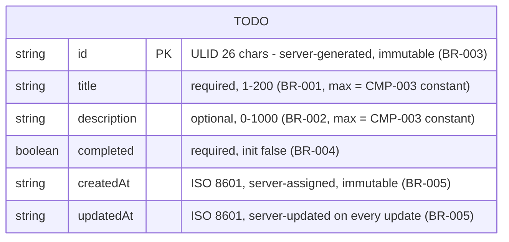
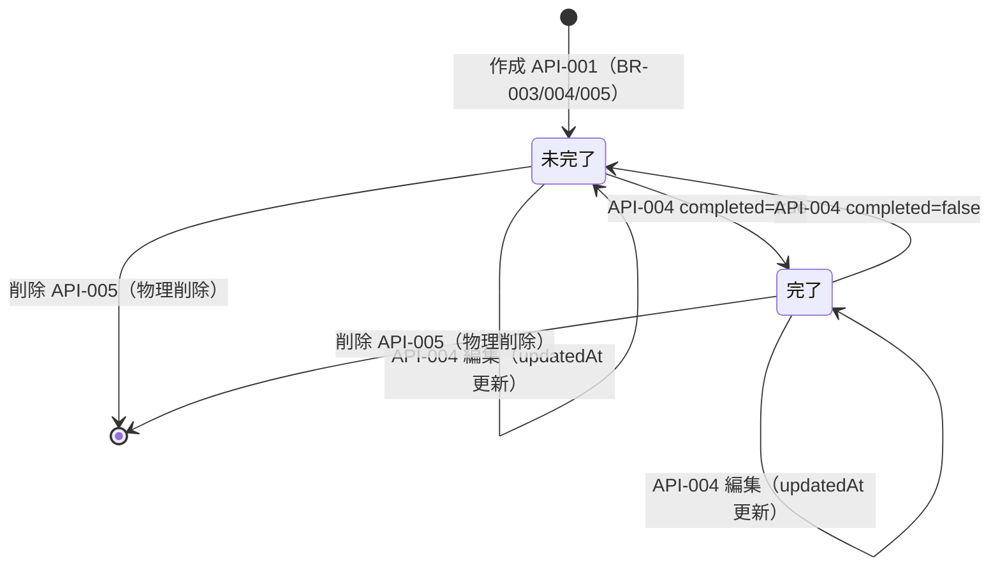

# Functional Spec — functional-design / unit: todo-app (UNIT-001)

> Stage: functional-design / Owner: aidlc-systems-architect-agent / 2026-06-10
> 本書は人間可読ビュー。**entities.yaml / rules.yaml が source of truth**（本書の図・表は両ファイルから導出）。
> API の正は api-specification.md。
> 決定の反映: Q1=a（順序保証 = CMP-002 / 第 2 キー id 降順）/ Q2=a（CORS 0 箇所）/ Q3=a（テスト境界値リテラル維持）/
> Q4=a（schema は CMP-002 専用公開面）/ Q5=a（CMP-003 ビルドなし — questions.md 回答済み）。

## Scope

| Unit | Components Covered | Source Stories |
|---|---|---|
| UNIT-001 todo-app | CMP-001（Todo Frontend）, CMP-002（Todo Backend API）, CMP-003（Shared Contract） | BT-1〜BT-7（story fallback — unit-story-map.md）+ 機能面 RF（RF-03〜09 / RF-12・RF-16 の API 側 / RF-22②） |

非機能面 RF（RF-01/02/10/11/13〜21、RF-22①③）は nfr-design / infrastructure-design / code-generation の管轄（unit-story-map.md の機能設計参照列を参照）。

## Entity Relationships

単一エンティティ（ENT-001 Todo、所有 = CMP-002）。リレーションなし — entities.yaml と一致。

## State Machines

### SM-001: Todo ライフサイクル（ENT-001）

| Entity ID | Current | Event | Next | Guard |
|---|---|---|---|---|
| ENT-001 | （存在しない） | 作成（API-001） | 未完了（completed=false） | 入力が有効（BR-001/002/008）。id/タイムスタンプはサーバー付与（BR-003/005）、completed=false 初期化（BR-004） |
| ENT-001 | 未完了 | 完了切替（API-004, completed=true） | 完了 | id が実在（BR-007）。updatedAt 更新（BR-005） |
| ENT-001 | 完了 | 完了切替（API-004, completed=false） | 未完了 | 同上 |
| ENT-001 | 未完了 / 完了 | 編集（API-004, title/description） | 同一状態（内容更新） | 入力が有効（BR-001/002/006/008/009）かつ id が実在（BR-007）。updatedAt 更新（BR-005） |
| ENT-001 | 未完了 / 完了 | 削除（API-005） | （削除済み — 終端。物理削除） | id が実在（BR-007 — 存在判定と削除はアトミック） |

## Workflows

> BT-1〜BT-7（unit-story-map.md の保持対象）をステップ列で記述。全ワークフローの前段に BR-013（意図経路の検証 — 403）が共通に適用される。

### WF-001: TODO 作成（BT-1）

1. ユーザーが CMP-001 の作成フォームに title（必須）・description（任意）を入力する — 文字数の入力補助は CMP-003 の共有定数を参照（UX 目的、防衛線ではない — BR-014）
2. CMP-001 が API-001 を呼び出す
3. CMP-002 がボディを解釈する — 不正 JSON は 400（BR-008）
4. CMP-002 が入力を検証する — title 1〜200 / description ≤1000（BR-001/002）。違反は 400 + フィールド別詳細
5. CMP-002 が id（ULID）を生成し（BR-003）、completed=false を初期化し（BR-004）、createdAt/updatedAt を付与する（BR-005）
6. CMP-002 が永続化し、201 + 作成された Todo を返す
7. CMP-001 が一覧の先頭に新規アイテムを表示する（BR-010 の createdAt 降順と整合する既存 UX）
8. 失敗時（4xx/5xx/通信エラー）: CMP-001 がユーザーにエラーを表示する（BR-011 — RF-05）

### WF-002: TODO 一覧表示（BT-2）

1. CMP-001 が初期ロードで API-002 を呼び出す
2. CMP-002 が全件を取得し、createdAt 降順・tie は id 降順でソートして返す（BR-010 — Q1=a。CMP-001 は防衛的ソートをしない）
3. CMP-001 が各アイテムの title / completed / **createdAt（人間可読形式 — RF-08）** を表示する（FR-002 の表示要素 3 点）
4. 0 件時: CMP-001 が空状態メッセージを表示する
5. 取得失敗時: CMP-001 が既存のエラー状態を表示する

### WF-003: TODO 編集（BT-3）

1. ユーザーが CMP-001 のアイテム上でインライン編集モードに入り title / description を変更する（インライン編集 UX が正 — BO-O3 / RF-22①）
2. CMP-001 が API-004 を呼び出す（変更フィールドのみの部分更新 — BR-006）
3. CMP-002 がボディ解釈（BR-008）→ 入力検証（BR-001/002）→ アトミックな条件付き書込（BR-007 — 存在しない id は 404、複合ケースは 400 優先 BR-009）を行い、updatedAt を更新して（BR-005）200 + 更新後 Todo を返す
4. CMP-001 が表示を更新する
5. 失敗時: CMP-001 がユーザーにエラーを表示する（BR-011）

### WF-004: 完了状態の切替（BT-4）

1. ユーザーが CMP-001 のチェックボックスをトグルする
2. CMP-001 が API-004 を `{completed: <bool>}` で呼び出す（API 上は WF-003 と同一操作）
3. CMP-002 が BR-007（実在）を確認してアトミックに更新し、updatedAt を更新して 200 を返す
4. 失敗時: CMP-001 がユーザーにエラーを表示する（BR-011）

### WF-005: TODO 削除（BT-5）

1. ユーザーが CMP-001 の削除操作を実行する
2. CMP-001 が API-005 を呼び出す
3. CMP-002 が存在判定と削除をアトミックに実行する（BR-007）— 存在しない id は 404、成功は 204（ボディなし）
4. CMP-001 が一覧からアイテムを除去する
5. 失敗時: CMP-001 がユーザーにエラーを表示する（BR-011）

### WF-006: TODO 個別取得（BT-6 — API 利用者のみ）

1. 外部 API 利用者が API-003 を呼び出す（UI からは呼ばれない。CMP-001 の未使用クライアントは削除 — RF-09。エンドポイントは公開コントラクトとして維持 — OOS-4）
2. CMP-002 が id で検索し、200 + Todo または 404（BR-007）を返す

### WF-007: ヘルスチェック（BT-7 — 運用トランザクション）

1. 運用者・監視・E2E が API-006 を呼び出す
2. CMP-002 が 200 + `{"status": "ok"}` を返す — 意図経路・ローカル経路で常に到達可能であること（BR-013 の誤拒否は回帰。E2E の BT-7 アサーションで検知 — RF-02）

## Rules Summary（rules.yaml から導出）

| ID | Rule | Category | Applies to |
|---|---|---|---|
| BR-001 | title 必須・1〜200 文字（上限 = CMP-003 共有定数） | validation | CMP-002 / ENT-001 / API-001, API-004 |
| BR-002 | description 任意・≤1000 文字（上限 = CMP-003 共有定数） | validation | CMP-002 / ENT-001 / API-001, API-004 |
| BR-003 | id はサーバー生成（ULID）・クライアント指定不可 | constraint | CMP-002 / ENT-001 / API-001 |
| BR-004 | completed は作成時 false 初期化 | constraint | CMP-002 / ENT-001 / API-001 |
| BR-005 | createdAt/updatedAt はサーバー付与・更新ごとに updatedAt 更新 | calculation | CMP-002 / ENT-001 / API-001, API-004 |
| BR-006 | 部分更新意味論 — 空オブジェクトも有効（RF-22②） | policy | CMP-002 / ENT-001 / API-004 |
| BR-007 | 存在しない id は 404・更新は upsert 禁止（アトミック存在判定 — RF-07） | constraint | CMP-002 / ENT-001 / API-003, API-004, API-005 |
| BR-008 | 不正 JSON ボディは 400（RF-04） | validation | CMP-002 / API-001, API-004 |
| BR-009 | 複合ケース（不正ボディ × 不存在 id）は 400 優先（BP-1 許容変更 4） | policy | CMP-002 / API-004 |
| BR-010 | 一覧は createdAt 降順 + id 降順 tie-break のソート済み（RF-06 — Q1=a） | constraint | CMP-002 / ENT-001 / API-002 |
| BR-011 | ミューテーション失敗はユーザー可視エラー（RF-05） | policy | CMP-001 / API-001, API-004, API-005 |
| BR-012 | 500 は内部情報非開示・詳細はサーバーログのみ（SECURITY-09 / RF-11） | policy | CMP-002 / 全 API |
| BR-013 | 意図経路外の直接アクセスは 403（RF-16） | authorization | CMP-002 / 全 API |
| BR-014 | 強制点は CMP-002 のみ・schema は CMP-002 専用公開面（Q4=a） | policy | CMP-003 / ENT-001 |

## 設計決定の記録（questions.md 回答の着地点）

| 決定 | 内容 | 着地成果物 |
|---|---|---|
| Q1=a | RF-06 は CMP-002 で実現。第 2 ソートキー id 降順 | BR-010 / API-002 / ENT-001 constraints |
| Q2=a | CORS 両方撤去（0 箇所）。同一オリジン前提を明文化。E2E（RF-02）による全 BT 検証が撤去の条件 | api-specification.md 通信前提 / components.yaml CMP-002 追記 |
| Q3=a | テストコードの境界値リテラルは維持（独立検証点） | BR-001/002 logic / entities.yaml constraints |
| Q4=a | frontend は型 + 制約定数のみ import。schema は CMP-002 専用公開面 | BR-014 / components.yaml CMP-003 追記 |
| Q5=a | CMP-003 はビルドなし（ソース直接参照）。型検査は CI の全 workspace 型検査で担保 | components.yaml CMP-003 追記（実装詳細は code-generation へ） |
