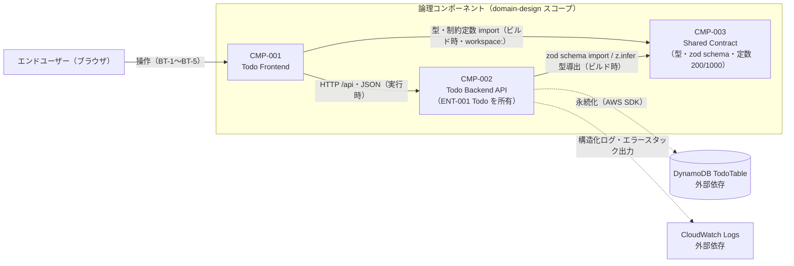

# Components — refactor-todo-app

> Stage: domain-design / Owner: aidlc-app-architect-agent
> 本書は `components.yaml`（機械可読カタログ）と同一データの人間可読ビュー。
> 構成決定: Q1=a（現状境界保持 + RF-03 反映）/ Q2=a（Todo 所有は backend、shared はコントラクト定義の単一ソース）/ Q3=a（非コンポーネント要素は本書の専用節に記録）— questions.md 回答済み・plan.md 承認済み（2026-06-10）。
> 注: 本ステージはデプロイトポロジー（モノリス/分割・ユニット編成）を決めない。それは units-generation の管轄。

## Component Diagram

- 実線 = コンポーネント間依存（components.yaml の Dependency / Dependent-Component と一致）
- 点線 = 外部依存（DynamoDB / CloudWatch Logs はコンポーネントではない — ステージ定義どおり依存として扱う）
- CMP-003 は依存グラフの葉（CMP-001 → CMP-003 ← CMP-002 の星形 — DEP-P1 のとおり）

## Component Summary

| Component ID | Component | Capability | Dependencies | Entities Owned |
|---|---|---|---|---|
| CMP-001 | Todo Frontend | エンドユーザーが TODO を操作する対話面（一覧・作成・インライン編集・トグル・削除、エラー/空状態表示） | CMP-002（HTTP /api、実行時）、CMP-003（型・定数、ビルド時） | —（所有なし） |
| CMP-002 | Todo Backend API | TODO 管理の業務ルールの唯一の強制点（検証・ULID 付与・タイムスタンプ・永続化・404 判定・安全なエラー隠蔽） | CMP-003（zod schema・`z.infer`、ビルド時）。外部依存: DynamoDB、CloudWatch Logs | **ENT-001 Todo** |
| CMP-003 | Shared Contract | frontend/backend 間コントラクト（型・zod schema・制約定数 200/1000）の単一ソース（RF-03 新設） | なし（葉） | —（定義専用、実行時振る舞いなし） |

### ENT-001 Todo（所有: CMP-002）

| 属性 | 型 | 制約（典拠: business-overview.md Business Dictionary / api-documentation.md Data Models） |
|---|---|---|
| id | string | ULID（26 文字、辞書順=時系列）。サーバー生成。DynamoDB PK |
| title | string | 必須、1〜200 文字（zod CreateTodoSchema / UpdateTodoSchema。200 は CMP-003 の共有定数） |
| description | string? | 任意、最大 1000 文字（zod。1000 は CMP-003 の共有定数） |
| completed | boolean | 必須。作成時 false 固定（CMP-002 が初期化） |
| createdAt | string | ISO 8601。作成時にサーバーが付与 |
| updatedAt | string | ISO 8601。更新のたびにサーバーが更新 |

## Rationale

| Component ID | Component | Why it's a separate component |
|---|---|---|
| CMP-001 | Todo Frontend | 関心（表示・操作 UX）と変更レート（UI 改善）が API と独立。実行時結合は HTTP のみで、データ所有を持たない。既存パッケージ `@todo-ai-dlc/frontend` の論理再記述 |
| CMP-002 | Todo Backend API | 業務ルール強制とデータ所有（ENT-001）の単一点。永続化・検証・ライフサイクルという独自の関心とテスト境界（21 ケース）を持つ。既存パッケージ `@todo-ai-dlc/backend` の論理再記述 |
| CMP-003 | Shared Contract | コントラクト定義という独自の関心。変更レートは「API コントラクトが変わるときのみ」で両者と異なり、両者から参照される唯一の共有点。RF-03（P0）が要求する構造変化 |

### 設計判断の根拠（Q1〜Q3 の反映）

- **Q1=a（現状境界の保持 + RF-03 反映）**: 本 intent は brownfield-refactoring で振る舞い保持（BP-1）が主軸。コンポーネント境界の変更を要件が要求する範囲（RF-03 の shared 新設）のみに限定した。既存のコード境界・テスト境界（45 ケース）・RE 観測との対応がそのまま保たれ、BP-1 の回帰判定が追跡しやすい。backend 内の routes → handlers → repositories、frontend 内の container/presentational は**コンポーネント内部の実装構造**であり境界ではない（各コンポーネントの Boundaries に明記）。技術層の昇格（Q1=b）は「境界は責務に従う」原則に反するため不採用、ドメイン中心再編（Q1=c）は HTTP 境界の実態と乖離するため不採用。
- **Q2=a（Todo 所有は backend / shared はコントラクト定義の単一ソース）**: 「すべてのエンティティに所有者は exactly 1」の原則に対し、所有を**ライフサイクルの強制点**（ULID 生成・completed 初期化・タイムスタンプ・永続化 = CMP-002）に置いた。CMP-003 は形状・制約値の**定義**の単一ソースであり所有者ではない。これにより「定義の共有」と「振る舞いの所有」が分離され、RF-03 の意図（乖離の構造的排除）と所有一意性の両方を満たす。units-generation・API 設計は所有者（CMP-002）に振る舞いを問える。
- **Q3=a（非コンポーネント要素は本書の専用節に記録）**: components.yaml はビジネスロジックを持つコンポーネントのみとし（ステージ定義の純度維持）、IaC・CI・E2E・開発環境・文書は本書「非コンポーネント要素」節で RF 対応とともに明示して units-generation へ引き継ぐ。RF 22 件のトレーサビリティは下表で全件完結する。

## RF トレーサビリティ（RF-01〜RF-22 全 22 件 — 漏れゼロ）

凡例: 「着地」= その RF の変更が実装されるコンポーネント、または非コンポーネント要素（詳細は次節）。

| RF | 優先度 | 内容（要約） | 着地 | 備考 |
|---|---|---|---|---|
| RF-01 | P0 | CI 検証ゲート（lint / typecheck / test / synth / audit） | 非コンポーネント（CI） | 対象は CMP-003 含む全 workspace パッケージ + IaC。audit 閾値は設計委譲 |
| RF-02 | P0 | E2E スモーク（BT-1〜5 + BT-7） | 非コンポーネント（E2E） | 検証対象は CMP-001 + CMP-002 の結合振る舞い。既存 data-testid を活用 |
| RF-03 | P0 | コントラクト一元化（@todo-ai-dlc/shared 新設） | **CMP-003**（新設） | CMP-001 / CMP-002 の重複定義置換と workspace: 依存追加を伴う |
| RF-04 | P1 | 不正 JSON ボディの 400 応答化 | **CMP-002** | 入力検証責務の一部 |
| RF-05 | P1 | ミューテーション失敗時のエラー表示 | **CMP-001** | 未処理 rejection の解消を含む |
| RF-06 | P1 | 一覧表示順の保証（createdAt 降順 + tie-break） | **CMP-001 または CMP-002** | 実現箇所（API かフロントソートか）と第 2 キー最終決定は設計委譲（下記申し送り 1） |
| RF-07 | P1 | 更新・削除の条件付き書込化（アトミック化） | **CMP-002** | 複合ケースの 400/404 優先順位は BP-1 許容変更 4 |
| RF-08 | P1 | createdAt の UI 表示（FR-002 ドリフト解消） | **CMP-001** | createdAt 表示の追加は BP-1 許容変更 2 |
| RF-09 | P1 | 未使用 `fetchTodo` の削除 | **CMP-001** | `GET /api/todos/:id`（BT-6）自体は CMP-002 が維持 |
| RF-10 | P1 | 構造化（JSON）リクエストログ | **CMP-002** | NFR-005 の基礎 |
| RF-11 | P1 | エラースタックのサーバーログ出力 | **CMP-002** | 500 応答ボディは不変（SECURITY-09 維持） |
| RF-12 | P1 | CORS の一元化 | **CMP-002** + 非コンポーネント（IaC） | 二重定義の両側: Hono `cors()` = CMP-002 / API GW `corsPreflight` = IaC。集約先（高々 1 箇所、0 も可）は設計委譲。CORS ヘッダの変更・消失は BP-1 許容変更 5（A-1 根拠） |
| RF-13 | P1 | frontend build の二重出力解消 | **CMP-001** | パッケージのビルド定義変更。業務振る舞い変化なし |
| RF-14 | P2 | IAM 最小権限化（5 アクション限定） | 非コンポーネント（IaC） | |
| RF-15 | P2 | CloudWatch アラーム 4 種（NFR-001 計測可能化） | 非コンポーネント（IaC) | 統計方法・評価期間は設計委譲 |
| RF-16 | P2 | execute-api 直接アクセスの 403 化 | **CMP-002** + 非コンポーネント（IaC） | ヘッダ検証 = CMP-002 / ヘッダ付与・Secret 管理 = IaC。ローカル経路方式は設計委譲。直接アクセスの 403 化は BP-1 許容変更 3 |
| RF-17 | P2 | CDK deprecated プロパティ移行 | 非コンポーネント（IaC） | |
| RF-18 | P2 | 依存メジャー更新（CDK / Vitest / Vite / Biome 等） | 非コンポーネント（依存管理） | 全 workspace 横断。CMP の論理構造に変更なし |
| RF-19 | P2 | Renovate 等の依存自動更新 | 非コンポーネント（依存管理） | |
| RF-20 | P2 | デプロイ手順のスクリプト化 | 非コンポーネント（デプロイ/開発基盤） | 暗黙のビルド順序（frontend build → cdk deploy）の明示化 |
| RF-21 | P2 | ローカル開発環境の堅牢化 | 非コンポーネント（開発環境） | `dev.ts` の PORT 環境変数化は CMP-002 の開発用エントリへの軽微な波及を含む（業務振る舞い変化なし） |
| RF-22 | P2 | 仕様・設計記述の現状一致 | 非コンポーネント（文書） | v1 application-design の TodoForm 記述 / PUT 部分更新意味論 / Lambda SDK 戦略の 3 点 |

**着地集計**: CMP-001 = 4 件（RF-05/08/09/13）、CMP-002 = 4 件（RF-04/07/10/11）、CMP-003 = 1 件（RF-03）、CMP-001/002 共同（択一・設計委譲）= 1 件（RF-06）、CMP-002 + IaC 共同 = 2 件（RF-12/16）、非コンポーネント単独 = 10 件（RF-01/02/14/15/17/18/19/20/21/22）。計 22 件 — 全 RF が着地済み。

### BP-1 / NFR の対応（付記）

| ID | 対応 |
|---|---|
| BP-1 | 全コンポーネント横断の制約。BT-1〜BT-7 の外部振る舞い保持（CMP-001: BT-1〜5 の操作面 / CMP-002: BT-1〜7 の API 面）。検証装置は RF-01/02（非コンポーネント） |
| NFR-001 | API 500ms の**充足主体は CMP-002**（RF-07 のアトミック化＝DynamoDB 呼出 2→1 回がレイテンシ改善に寄与）。計測可能化（計測装置）は RF-15（非コンポーネント/IaC — アラーム閾値は 500ms と整合、申し送り 6）。フロント 3 秒側は本 intent 計測対象外 |
| NFR-002 | 非コンポーネント（IaC）— 全マネージドサービス構成で充足済み |
| NFR-003 | CMP-002（zod 検証の維持 + RF-04/10/11、および RF-12/16 の API 側）+ 非コンポーネント IaC（RF-14/17、および RF-12/16 の IaC 側）— requirements.md「RF ↔ RE ↔ v1 対応表」の NFR-003 紐づけ 7 件（RF-04/10/11/12/14/16/17）と一致 |
| NFR-004 | 全体: CMP-003（RF-03）、CMP-001（RF-13）、非コンポーネント（RF-01/02/18〜21） |
| NFR-005 | CMP-002（RF-10/11）+ 非コンポーネント（RF-15） |
| NFR-006 | 非コンポーネント（RF-01/02）。typecheck/test の対象に CMP-003 を含む |
| NFR-007 | 非コンポーネント（RF-19 + RF-01 の pnpm audit） |

## 非コンポーネント要素（units-generation への引き継ぎ — Q3=a）

以下はビジネスロジック・エンティティを持たず、ステージ定義上のコンポーネント（書くコードの論理ブロック）に該当しない。ただし RF の着地先・ユニット編成の対象として units-generation が必ず扱うこと。

| 要素 | 実体（現状） | 担う RF | units-generation への引き継ぎ事項 |
|---|---|---|---|
| IaC | `@todo-ai-dlc/infrastructure`（CDK 単一スタック TodoStack。CMP-002 をバンドル・CMP-001 の dist をデプロイする結合点） | RF-14 / RF-15 / RF-16（ヘッダ付与・Secret 側） / RF-17 / RF-12（corsPreflight 側） | どのユニットに載せるか。CMP-002 ソース直結バンドル・CMP-001 dist 参照という結合（DEP-O1/O2）の扱い |
| CI | 現状不在（`.github/` なし。A-4: GitHub Actions 想定） | RF-01 | 全 workspace（CMP-003 含む）+ synth + audit を 1 ゲートに束ねる。P0 のため最初のユニットに含める前提 |
| E2E テスト | 現状不在（data-testid は全 UI 要素に付与済み） | RF-02 | docker-compose 環境で BT-1〜5 + BT-7。CI への組み込み。P0 |
| 開発環境 | docker-compose / Dockerfile.dev / .env.example / ルート scripts | RF-18 / RF-19 / RF-20 / RF-21 | デプロイ script の置き場（ルート）。Dockerfile.dev 堅牢化。依存更新は全パッケージ横断のため独立ユニット化も検討 |
| 文書 | README / v1 aidlc-docs（application-design 等） | RF-22 | コード変更ゼロ・回帰リスクゼロ。どのユニットに同梱するか（関連変更と同時が望ましい: 例 RF-22②は RF-04/07 と同じユニット） |

## 下流への申し送り（設計ステージへの委譲事項）

domain-design では決めない（= 本ステージの管轄外として明示的に未決のまま渡す）事項。requirements.md が「設計ステージで決定」と明記したものを含む。

1. **RF-06 の実現箇所**: 一覧の createdAt 降順保証を CMP-002（API がソートして返す）か CMP-001（フロントがソートして表示）のどちらで実現するか。第 2 ソートキー（候補: id 降順 — ULID は辞書順=時系列）の最終決定も含む。components.yaml では両コンポーネントの Source に RF-06 を候補として記載済み
2. **RF-12 の集約先**: CORS 定義を CMP-002（Hono）側に残すか、IaC（API GW）側に残すか、両方撤去（0 箇所）するか
3. **RF-16 のローカル経路方式**: CloudFront が存在しない docker-compose / Vite proxy 経路での検証の無効化またはヘッダ注入の方式。Secret の synth テンプレート・Lambda 環境変数上の可視性の扱い（保護目標はリポジトリへの平文コミット防止まで）
4. **RF-01 の pnpm audit 閾値**: 修正不能な上流 advisory で CI が恒常 fail しない severity 設計（例: `--audit-level=high`）
5. **RF-03 のテストコード境界値リテラル**: テスト内の 200/1000 リテラルを許容するか CMP-003 の共有定数から導出するか
6. **RF-15 のアラーム統計**: API GW Latency はコールドスタートを含むため、NFR-001「コールドスタート除く 500ms」で誤報しない統計方法（p95 等）と評価期間
7. **CMP-003 の内部構成**: CMP-001 が zod に依存するか（schema ごと import）、型と定数のみ参照するか（zod 依存を CMP-002 限定にできる — CS-P1 トレードオフ）。**注: RF-03 本文は「frontend は型と定数を `workspace:` 依存で import する」と規定済み**（受入基準は schema import を禁止していないが、要件本文上は型・定数 import が既決）。schema import を選ぶ場合は要件著者と整合確認のうえ要件文言の更新を要する。いずれの場合も frontend 側検証を防衛線にしない（強制点は CMP-002）という意図は維持すること。CMP-003 のビルド形態（tsc ビルド or ソース直接参照）は真正の未決事項として units-generation / 設計で決定
8. **RF-22 ① の更新対象**: v1 application-design の TodoForm 記述更新（本ステージの components.yaml/md は v2 の新規 blueprint であり、v1 文書の更新そのものは RF-22 の実装時に行う）

## セルフチェック記録

- components.yaml ⇄ components.md の内容一致（コンポーネント 3 件・依存方向・ENT-001 属性・Source ID）を確認済み
- 双方向依存の整合: CMP-001→CMP-002/CMP-003、CMP-002→CMP-003 のすべてに対応する Dependent-Component 逆参照あり
- エンティティ所有一意性: ENT-001 は CMP-002 のみが所有（exactly 1）
- ステージ定義適合: 全コンポーネントが「書くコード」。DynamoDB / CloudWatch / Lambda / CloudFront はコンポーネントとして混入していない。デプロイトポロジー未決定
- BP-1 整合: コンポーネント境界の変更は RF-03（CMP-003 新設）のみ。BT-1〜BT-7 の記述は RE（business-overview.md / api-documentation.md）と一致
- mermaid 図は mmdc（mermaid-cli）で構文検証済み

## Refine 記録（contributor feedback への対処 — 2026-06-10）

> contributor: aidlc-product-manager-agent（`aidlc-product-manager-agent-contribution.md`）。指摘 4 件（中 M-1/M-2 / 低 L-1/L-2）すべてを反映した。対処しなかった指摘はない。

| 指摘 | 対処 |
|---|---|
| M-1 | 付記表の NFR-003 行を requirements.md「RF ↔ RE ↔ v1 対応表」の原典（NFR-003 紐づけ = RF-04/10/11/12/14/16/17 の 7 件）と一致するよう修正。欠落していた RF-04/11（CMP-002）・RF-17（IaC）を補完し、RF-12/16 の振り分けを主表どおり「API 側 = CMP-002 / IaC 側 = 非コンポーネント」の共同着地として両側に明記 |
| M-2 | 申し送り 7 に「RF-03 本文は frontend = 型と定数の import を規定済み。schema import を選ぶ場合は要件著者と整合確認のうえ要件文言の更新を要する。frontend 側検証を防衛線にしない（強制点は CMP-002）意図は維持」を付記。CMP-003 のビルド形態は真正の未決事項としてそのまま委譲 |
| L-1 | RF トレーサビリティ表の RF-08 行に「BP-1 許容変更 2」、RF-12 行に「BP-1 許容変更 5（A-1 根拠）」、RF-16 行に「BP-1 許容変更 3」を備考付記。RF-07 行の「許容変更 4」と合わせ、BP-1 が列挙する承認済み振る舞い変更 5 件のうち RF 単位で特定できる 4 件（2/3/4/5。変更 1 = Q2=b の 4 件は RF-04〜07 として主表に展開済み）の回帰判定線が components 単体で完結 |
| L-2 | 付記表の NFR-001 行に充足主体 = CMP-002（RF-07 アトミック化の DynamoDB 呼出 2→1 回がレイテンシ改善に寄与）と計測装置 = RF-15（IaC、申し送り 6 のアラーム統計と接続）を明記。CMP-002 の Source への NFR-001 追加は行わない（本 intent は性能目標を変更せず、contribution も Source 追加を必須としていないため — yaml の構造不変を維持） |

- 対処しなかった指摘: なし
- components.yaml の変更: なし（contribution の総評どおり、4 件とも components.md の付記表・備考・申し送り文言の補正であり、yaml の構成・依存・Source・Entities に影響しない）。修正後に yaml ⇄ md の 2 ビュー一致（コンポーネント 3 件・依存方向・ENT-001 属性・Source ID・RF-12/16 の API 側/IaC 側コメント）を再確認済み
