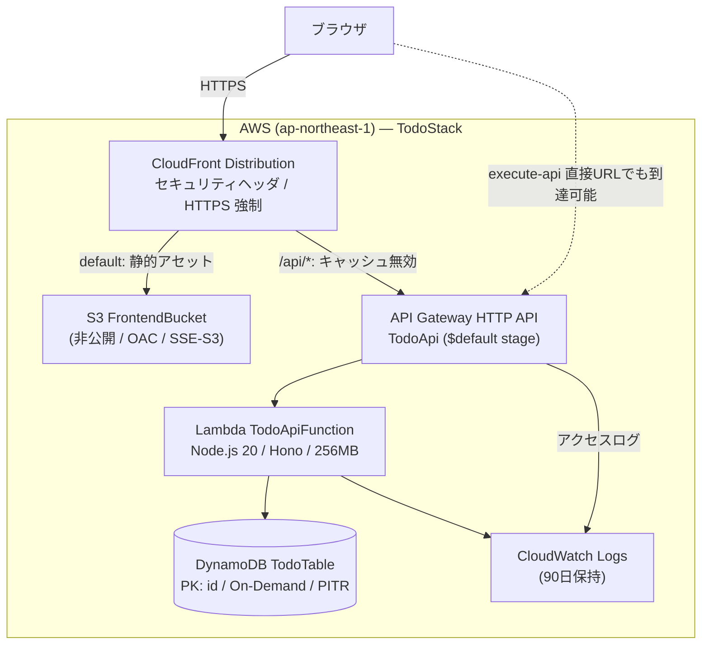
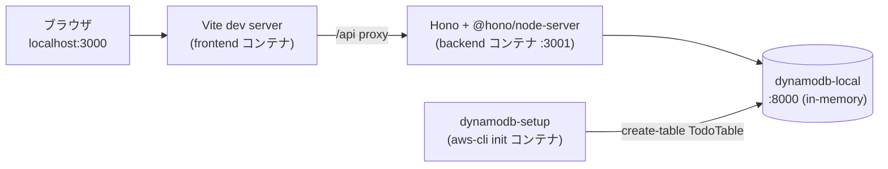
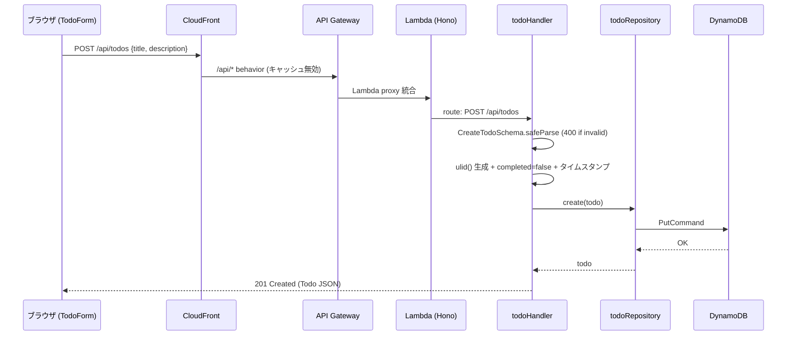

# System Architecture

> Stage: reverse-engineering / Owner: aidlc-systems-architect-agent
> 注: ステージ定義にある `component-inventory.md` は本 intent では**省略**した（Q1=b）。本システムは 3 パッケージ構成であり、インベントリ表は本書「Component Descriptions」と完全に重複するため。カテゴリ別件数は code-structure.md のファイルインベントリで代替できる。

## System Overview

pnpm monorepo（3 パッケージ）で構成された サーバーレス 3 層構成の TODO Web アプリケーション。

- **配信層:** S3 に置いた React SPA を CloudFront が配信。`/api/*` のみ API Gateway オリジンへルーティングし、ブラウザから見て同一オリジンで API を提供する
- **API 層:** API Gateway (HTTP API) → Lambda（Hono アプリを `hono/aws-lambda` の `handle()` でラップ）。routes → handlers → repositories の薄いレイヤード構成
- **データ層:** DynamoDB 単一テーブル `TodoTable`（PK: `id`、オンデマンド課金）

ローカル開発は docker-compose（dynamodb-local + テーブル作成 init コンテナ + backend/frontend ホットリロード）で完結し、frontend dev server の `/api` プロキシが本番の CloudFront ルーティングを模倣する。

## Architecture Diagram

ローカル開発時:

## Component Descriptions

### @todo-ai-dlc/frontend

- **Purpose:** TODO 操作の SPA（React 19 + Vite 6 + Tailwind CSS 4）
- **Responsibilities:** 状態管理（`App.tsx` の useState/useEffect）、API 呼出（`api/todoApi.ts`）、表示（TodoForm / TodoList / TodoItem）
- **Dependencies:** backend へは HTTP（`/api`）のみ。コードレベルの依存なし。`VITE_API_URL` で API ベース URL を上書き可（既定 `/api`）
- **Type:** プレゼンテーション層（SPA）

### @todo-ai-dlc/backend

- **Purpose:** TODO CRUD REST API（Hono 4）
- **Responsibilities:** ルーティング（`routes/todos.ts`）、検証と業務ロジック（`handlers/todoHandler.ts` + zod）、永続化（`repositories/todoRepository.ts`）、横断処理（`index.ts`: cors / logger / グローバルエラーハンドラ）。Lambda handler と ローカル用 Node サーバー（`dev.ts`）の二重エントリ
- **Dependencies:** DynamoDB（`@aws-sdk/lib-dynamodb`）。`DYNAMODB_ENDPOINT` でローカルへ切替
- **Type:** アプリケーション層（サーバーレス API）

### @todo-ai-dlc/infrastructure

- **Purpose:** AWS リソースの IaC 定義（AWS CDK 2.177、単一スタック `TodoStack`）
- **Responsibilities:** DynamoDB / Lambda（NodejsFunction が backend ソースを直接バンドル）/ API Gateway / S3 / CloudFront / BucketDeployment / CfnOutput（CloudFrontUrl, ApiUrl, TableName）
- **Dependencies:** `../backend/src/index.ts`（Lambda entry）と `../frontend/dist`（デプロイ資産）への相対パス参照
- **Type:** インフラ層（IaC）

### ルート開発環境（monorepo ツーリング）

- **Purpose:** ワークスペース管理と開発体験
- **Responsibilities:** pnpm workspace、Biome（lint/format 一元化）、共有 tsconfig（strict）、docker-compose / Dockerfile.dev / .env.example
- **Type:** 開発基盤

## Data Flow

TODO 作成（BT-1）の本番経路:

更新/削除は handler が `findById` で存在確認（404 判定）後に `update`/`delete` を発行する 2 往復構成。一覧は `ScanCommand` で全件取得。

## Integration Points

### 外部公開 API（ブラウザ → システム）

| Name | Purpose | Protocol/Method | Auth |
|---|---|---|---|
| CloudFront default behavior | SPA 静的配信（SPA fallback: 403/404→index.html） | HTTPS（REDIRECT_TO_HTTPS） | なし（公開） |
| CloudFront `/api/*` behavior | API への同一オリジンルーティング | HTTPS、全メソッド許可、キャッシュ無効 | なし |
| API Gateway `TodoApi` | REST API（`/{proxy+}` ANY → Lambda） | HTTPS（execute-api URL でも直接到達可能） | なし |

### AWS サービス統合（システム内部）

| Name | Purpose | Protocol/Method | Auth |
|---|---|---|---|
| Lambda → DynamoDB | Todo 永続化 | AWS SDK v3（HTTPS） | IAM（`grantReadWriteData` による実行ロール権限） |
| CloudFront → S3 | 静的アセット取得 | OAC（Origin Access Control） | OAC（バケットは全公開ブロック） |
| Lambda / API GW → CloudWatch Logs | 実行ログ・アクセスログ | マネージド | IAM |

### ローカル開発統合

| Name | Purpose | Protocol/Method | Auth |
|---|---|---|---|
| Vite proxy `/api` | dev server から backend への中継（`VITE_PROXY_TARGET`） | HTTP | なし |
| backend → dynamodb-local | ローカル永続化（`DYNAMODB_ENDPOINT`） | HTTP :8000 | ダミー認証情報 |

## Infrastructure Components

- **IaC approach:** AWS CDK v2（TypeScript、`npx tsx bin/app.ts` 実行）
- **Stacks:** `TodoStack` 単一（DynamoDB + Lambda + API GW + S3 + CloudFront + BucketDeployment + Outputs）
- **Deployment model:** `frontend build` で `dist/` を生成 → `cdk deploy`（BucketDeployment が S3 同期 + CloudFront invalidation、NodejsFunction が backend を esbuild バンドル）。CI/CD パイプラインは存在しない（手動 CLI 前提）
- **Networking:** VPC なし（全てマネージド/パブリックサービス）。リージョンは `CDK_DEFAULT_REGION` 既定 ap-northeast-1

---

## Observations（観測事項 — 事実の記録）

| # | 観測事項 | 根拠 |
|---|---|---|
| AR-O1 | **CORS が二重定義**されている: API Gateway `corsPreflight.allowOrigins: ["*"]` と Hono `cors()`（既定=全オリジン許可）。一方、本番の想定経路は CloudFront 同一オリジン（`/api/*`）であり、その経路では CORS 自体が不要 | `lib/todo-stack.ts:61-68`、`backend/src/index.ts:10` |
| AR-O2 | API Gateway の execute-api エンドポイントは CloudFront を経由せず**直接アクセス可能**で、`ApiUrl` として CfnOutput にも出力されている。WAF・オリジン検証ヘッダ・スロットリング個別設定はない | `lib/todo-stack.ts:70-74, 194-197` |
| AR-O3 | **［v1 ドリフト］** v1 infrastructure-design は Lambda 実行ロールを「GetItem/PutItem/UpdateItem/DeleteItem/Scan の 5 アクション限定」と記述するが、実装は `grantReadWriteData()` であり、BatchGet/BatchWrite/Query/ConditionCheckItem 等を含む**より広い権限セット**が付与される | `lib/todo-stack.ts:53` vs `aidlc-docs/construction/infrastructure/infrastructure-design/infrastructure-design.md` §6 |
| AR-O4 | **［v1 ドリフト］** コードコメントは「SECURITY-03: structured logging」と主張するが、`hono/logger` はプレーンテキスト出力であり構造化（JSON）ログではない。構造化されているのは API Gateway アクセスログ（JSON フォーマット定義あり）のみ | `backend/src/index.ts:9-11`、`lib/todo-stack.ts:85-95` |
| AR-O5 | グローバルエラーハンドラは `err.message` のみを `console.error` に出力し、スタックトレースを**サーバー側ログにも残さない**（クライアントへの非開示=SECURITY-09 は満たすが、調査可能性が低い） | `backend/src/index.ts:14-17` |
| AR-O6 | DynamoDB テーブル名が `"TodoTable"` に固定されているため、同一アカウント・リージョンに本スタックを複数デプロイできない（ステージ分離不可）。`RemovalPolicy.DESTROY` + PITR 有効という組合せもデモ用途を反映 | `lib/todo-stack.ts:23-29` |
| AR-O7 | CDK の deprecated プロパティを使用: `pointInTimeRecovery: true`（→ `pointInTimeRecoverySpecification` へ移行推奨）と `logRetention`（カスタムリソースを生成。→ `logGroup` 指定へ移行推奨） | `lib/todo-stack.ts:27, 49` |
| AR-O8 | 観測性は CloudWatch Logs のみ。メトリクスアラーム・X-Ray トレーシング・ダッシュボードは未定義 | `lib/todo-stack.ts`（該当定義なし） |
| AR-O9 | 更新/削除は handler の `findById` → `update`/`delete` の 2 往復で、存在確認と書込が非アトミック（TOCTOU）。単一ユーザーのデモでは実害は限定的 | `handlers/todoHandler.ts:46-75` |
| AR-O10 | CSP の `connect-src 'self'` は CloudFront 同一オリジン構成と整合しており、SPA が execute-api 直接 URL を叩く構成に変えると CSP 違反になる（現構成では問題なし） | `lib/todo-stack.ts:114-118` |

## Refactoring Proposals（リファクタリング提案 — 下流ステージの判断材料）

| # | 提案 | 対応する観測 | トレードオフ |
|---|---|---|---|
| AR-P1 | CORS を一元化する: 本番経路が CloudFront 同一オリジンである事実に基づき、API GW の `corsPreflight` を撤去または許可リスト化し、Hono `cors()` はローカル開発限定（または削除。Vite proxy 経由なら不要）にする | AR-O1 | 設定箇所が減り意図が明確になる。直接 API を叩く外部クライアントを将来想定するなら許可リスト方式を選ぶ |
| AR-P2 | execute-api 直接アクセスの扱いを決める: (a) CloudFront からのカスタムヘッダを Lambda/API GW で検証、(b) WAF 追加、(c) デモ用途として現状容認を明文化 — のいずれかを requirements-analysis で決定 | AR-O2 | (a) は低コストで効果的。(c) でも「意図した公開」と記録することに価値がある |
| AR-P3 | エラーハンドラで `err.stack` をサーバー側ログに出力する（レスポンスは現状どおり汎用メッセージ維持） | AR-O5 | 数行の変更で調査可能性が大幅に向上。SECURITY-09 とは両立する |
| AR-P4 | `tableName` のハードコードを撤去（CDK 自動命名 + `TABLE_NAME` 環境変数渡しは既に実装済みのため、固定名を外すだけで複数環境デプロイが可能になる） | AR-O6 | 既存テーブルからのデータ移行が必要になる点に注意 |
| AR-P5 | deprecated プロパティを後継 API へ移行（`pointInTimeRecoverySpecification`、`logGroup` 明示作成）。CDK バージョン更新（technology-stack.md TS-P1）と同時に実施 | AR-O7 | 機械的な置換で済む。logRetention 廃止でカスタムリソース 1 つが消える |
| AR-P6 | 最小限の観測性を追加: Lambda エラー率・スロットリングの CloudWatch アラーム、（任意で）X-Ray | AR-O8 | 教材として「観測性の実装例」を示す価値あり。コスト増は微小 |
| AR-P7 | 更新/削除を条件付き書込（`ConditionExpression: attribute_exists(id)`）に変更し、findById 往復を削減してアトミック化 | AR-O9 | レイテンシ・コスト減。404 判定は ConditionalCheckFailedException ハンドリングへ移る |
