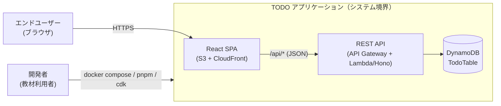

# Business Overview

> Stage: reverse-engineering / Owner: aidlc-systems-architect-agent
> 解析対象: `packages/` 配下（コードが真実のソース）。v1 設計成果物（`aidlc-docs/`）は用語・要件 ID の文脈参照に使用（Q3=c）。
> 本書は「事実の記述」を基本とし、**Observations（観測事項）** と **Refactoring Proposals（リファクタリング提案）** を末尾に明確に分離して記載する（Q2=c）。

## Business Context Diagram

## Business Description

- **Domain:** 個人タスク管理（TODO 管理）。実態としては Fusic 社の **AWS AI-DLC ワークフロー実践教材**（ルート package.json の description、README に明記）であり、認証なしのデモ用途。
- **Purpose:** ユーザーが TODO アイテムを作成・一覧・編集・完了切替・削除できる単一リストの Web アプリケーション。同時に、AI-DLC ワークフロー（要件定義→設計→実装）の実践例を提供する教材としての役割を持つ。
- **Key Business Transactions:**

| # | Transaction | Description | Actors |
|---|---|---|---|
| BT-1 | TODO 作成 | タイトル（必須・最大200字）と説明（任意・最大1000字）を入力して TODO を登録。ULID と作成/更新日時が自動付与される（v1 FR-001 相当） | エンドユーザー（TodoForm） |
| BT-2 | TODO 一覧表示 | 全 TODO を一覧表示。空の場合は空状態メッセージを表示（v1 FR-002 相当） | エンドユーザー（App 初期ロード） |
| BT-3 | TODO 編集 | タイトル・説明をインライン編集して保存（v1 FR-003 相当） | エンドユーザー（TodoItem 編集モード） |
| BT-4 | 完了状態の切替 | チェックボックスで完了/未完了をトグル（v1 FR-003 相当、API 上は BT-3 と同じ PUT） | エンドユーザー（TodoItem） |
| BT-5 | TODO 削除 | TODO アイテムを削除（v1 FR-004 相当） | エンドユーザー（TodoItem） |
| BT-6 | TODO 個別取得 | ID 指定で 1 件取得。API（GET /api/todos/:id）と API クライアント（`todoApi.fetchTodo`）に存在するが、**UI からは呼ばれていない** | （API 利用者のみ） |
| BT-7 | ヘルスチェック | `/api/health` で稼働確認を返す（運用トランザクション） | 運用者・監視 |

## Business Dictionary

| Term | Meaning | Context |
|---|---|---|
| Todo | タスク 1 件を表すエンティティ（id / title / description / completed / createdAt / updatedAt） | backend・frontend 両方の `types/todo.ts` に同名 interface として定義（重複定義） |
| title | TODO のタイトル。必須・1〜200 文字 | zod `CreateTodoSchema` / `UpdateTodoSchema`（backend）、`maxLength` 属性（frontend） |
| description | TODO の詳細説明。任意・最大 1000 文字 | 同上 |
| completed | 完了状態。boolean、作成時は false 固定 | `todoHandler.create` で `false` 初期化 |
| ULID | 辞書順ソート可能な一意 ID。`id` フィールドに使用 | `ulid` パッケージで `todoHandler.create` が生成 |
| createdAt / updatedAt | ISO 8601 文字列の作成/更新日時 | handler（作成時）・repository（更新時）が `new Date().toISOString()` で設定 |
| TodoTable | DynamoDB テーブル名（PK: `id`）。環境変数 `TABLE_NAME` で上書き可、既定値 "TodoTable" | repository / CDK / docker-compose で同名 |
| FR-xxx / NFR-xxx | v1 要件 ID（機能要件/非機能要件）。`aidlc-docs/inception/requirements/requirements.md` で定義 | 本 intent では文脈参照用 |
| SECURITY-xx | v1 のセキュリティベースライン要件 ID。コードコメントに参照が残る（SECURITY-01〜15） | `packages/backend/src/index.ts`、`types/todo.ts`、`lib/todo-stack.ts` のコメント |
| AI-DLC | AI Development Lifecycle。本リポジトリが教材として実践するワークフロー | README、`aidlc-docs/`（v1）、`org-ai-kb/`（v2） |

## Component-Level Business Descriptions

### @todo-ai-dlc/frontend（packages/frontend）

- **Business purpose:** エンドユーザーが TODO を操作する SPA。日本語 UI。
- **Responsibilities:** TODO の一覧表示・作成フォーム・インライン編集・完了トグル・削除。ロード中/エラー/空状態の表示。
- **Transactions involved:** BT-1, BT-2, BT-3, BT-4, BT-5

### @todo-ai-dlc/backend（packages/backend）

- **Business purpose:** TODO の CRUD を提供する REST API。ビジネスルール（必須/文字数制限、completed 初期値、タイムスタンプ付与）の唯一の強制点。
- **Responsibilities:** 入力検証（zod）、ID 生成（ULID）、存在チェックと 404 応答、DynamoDB への永続化、エラーの安全な隠蔽。
- **Transactions involved:** BT-1〜BT-7（全件）

### @todo-ai-dlc/infrastructure（packages/infrastructure）

- **Business purpose:** 本番相当の AWS 実行環境（配信・API・データストア）の宣言的定義。
- **Responsibilities:** DynamoDB / Lambda / API Gateway / S3 / CloudFront の構成、セキュリティ設定（暗号化・公開ブロック・セキュリティヘッダ・アクセスログ）、フロントエンド成果物のデプロイ。
- **Transactions involved:** 全 BT の実行基盤（直接のトランザクション処理はなし）

### ルート開発環境（docker-compose / Dockerfile.dev / .env.example）

- **Business purpose:** 教材として「clone して `docker compose up` で動く」開発体験を提供。
- **Responsibilities:** DynamoDB Local + テーブル自動作成 + backend/frontend のホットリロード起動。
- **Transactions involved:** 全 BT のローカル実行基盤

---

## Observations（観測事項 — 事実の記録）

| # | 観測事項 | 根拠 |
|---|---|---|
| BO-O1 | **認証・認可が存在しない**。全ユーザーが単一の共有 TODO リストを操作する（マルチテナントなし）。これは v1 NFR-003「認証なし（デモ用途）」および Out of Scope と整合しており、ドリフトではなく設計どおり | `packages/backend/src/index.ts`（認証ミドルウェアなし）、v1 requirements.md |
| BO-O2 | **［v1 ドリフト］** v1 FR-002 は「各アイテムにはタイトル、完了状態、**作成日時**が表示される」と定めるが、`TodoItem` は title / description / completed のみ表示し、createdAt を表示しない | `packages/frontend/src/components/TodoItem.tsx:75-114` vs `aidlc-docs/inception/requirements/requirements.md` FR-002 |
| BO-O3 | **［v1 ドリフト］** v1 application-design は「TodoForm — TODO の新規作成・**編集**用フォーム」とするが、実装では TodoForm は新規作成専用で、編集 UI は TodoItem 内のインライン編集として実装されている | `packages/frontend/src/components/TodoForm.tsx` / `TodoItem.tsx` vs `aidlc-docs/inception/application-design/components.md` |
| BO-O4 | `GET /api/todos/:id`（BT-6）と `todoApi.fetchTodo` は実装・テスト済みだが、UI のどこからも呼ばれていない（デッドコード相当） | `packages/frontend/src/api/todoApi.ts:22-25`、`App.tsx`（呼出なし） |
| BO-O5 | 一覧の表示順は保証されていない。新規作成時はフロントが先頭に追加するが、リロード後は DynamoDB Scan の返却順（不定）になる。要件にも表示順の定めはない | `App.tsx:31`（prepend）、`todoRepository.findAll`（Scan） |
| BO-O6 | ビジネスルール（文字数制限）はフロント（maxLength 属性）とバック（zod）で二重に実装されているが、共有定義はなく数値リテラルが 4 箇所に散在する | `TodoForm.tsx` / `TodoItem.tsx` の maxLength、`backend/src/types/todo.ts` の zod schema |

## Refactoring Proposals（リファクタリング提案 — 下流ステージの判断材料）

| # | 提案 | 対応する観測 | 備考 |
|---|---|---|---|
| BO-P1 | FR-002 のドリフト解消: TodoItem に createdAt 表示を追加する **か**、要件側を「表示しない」に更新する（どちらかを requirements-analysis で決定） | BO-O2 | 表示追加は小改修。教材としては要件と実装の一致が望ましい |
| BO-P2 | TodoForm の責務を v1 設計（作成・編集兼用）に合わせる **か**、設計記述を現実装（作成専用 + TodoItem インライン編集）に更新する | BO-O3 | 現実装の UX は妥当。設計ドキュメント側の更新を推奨 |
| BO-P3 | 未使用の `fetchTodo` / BT-6 を削除するか、詳細表示ユースケースを正式化する | BO-O4 | 削除なら API エンドポイント自体の要否も requirements-analysis で判断 |
| BO-P4 | 一覧の表示順序を要件化し（例: createdAt 降順）、実装で保証する（ULID は辞書順=時系列のためソートキー流用可） | BO-O5 | BO-P1 と同時に扱うと整合的 |
| BO-P5 | バリデーション定数（200/1000）を共有定義に集約する（共有パッケージ化は dependencies.md DEP-P1 参照） | BO-O6 | フロント・バック間の閾値乖離を構造的に防ぐ |
