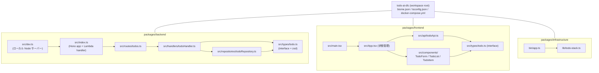

# Code Structure

> Stage: reverse-engineering / Owner: aidlc-systems-architect-agent
> 解析対象: `packages/` 配下 + ルートの開発環境設定。ソース全数（テスト含む）を読解済み。

## Build System

- **Type:** pnpm workspace（pnpm@9.15.0、corepack 管理）。タスクランナーは pnpm scripts のみ（turbo 等なし）
- **Configuration files:** ルート `package.json` / `pnpm-workspace.yaml` / `pnpm-lock.yaml` / `biome.json` / `tsconfig.json`（共有 strict 設定）、各パッケージの `package.json` / `tsconfig.json`（ルートを extends）/ `vitest.config.ts`、`docker-compose.yml` / `Dockerfile.dev` / `.env.example`
- **Build command:** `pnpm build`（= `pnpm -r build`。build script を持つのは frontend のみ: `tsc && vite build`）。backend は CDK `NodejsFunction` が esbuild で直接バンドルするため独自 build なし。infrastructure は `pnpm --filter @todo-ai-dlc/infrastructure synth|deploy|diff`
- **Test command:** `pnpm test`（= `pnpm -r test`、各パッケージで `vitest run`）。lint は `pnpm lint`（`biome check .`）、型検査は各パッケージの `typecheck`（`tsc --noEmit`）
- **ローカル起動:** `docker compose up --build`（dynamodb-local + テーブル作成 + backend:3001 + frontend:3000）またはホスト直接（`pnpm dev` + `pnpm --filter @todo-ai-dlc/backend dev`）

## Module Hierarchy

## Existing Files Inventory

ソースファイル: 実装 16 + テスト 7 + 設定/環境 21（計 44。うち brownfield 修正候補の中心は下表）。テストケース総数 45（backend 21 / frontend 17 / infrastructure 7）。

### packages/backend（Hono API）

| Path | Purpose | Layer/Role |
|---|---|---|
| `packages/backend/src/index.ts` | Hono app 組立: cors / logger / onError / ルート登録 / `handle(app)` Lambda export | エントリポイント（横断処理） |
| `packages/backend/src/dev.ts` | `@hono/node-server` でローカル起動（port 3001 固定） | 開発用エントリ |
| `packages/backend/src/routes/todos.ts` | `/api/todos` の 5 ルート定義 → handler 委譲 | ルーティング層 |
| `packages/backend/src/handlers/todoHandler.ts` | zod 検証、ULID 生成、存在チェック、HTTP ステータス決定 | ハンドラ層（業務ロジック） |
| `packages/backend/src/repositories/todoRepository.ts` | DynamoDB DocumentClient で CRUD（Scan/Get/Put/Update/Delete） | リポジトリ層（永続化） |
| `packages/backend/src/types/todo.ts` | `Todo`/`CreateTodoInput`/`UpdateTodoInput` interface + zod schema（SECURITY-05） | 型・検証定義 |
| `packages/backend/src/handlers/todoHandler.test.ts` | handler 14 ケース（repository をモック、Hono `app.request` で HTTP レベル検証） | テスト |
| `packages/backend/src/repositories/todoRepository.test.ts` | repository 7 ケース（SDK をモック） | テスト |
| `packages/backend/vitest.config.ts` | node 環境、coverage 設定（v8、types/dev.ts 除外） | 設定 |

### packages/frontend（React SPA）

| Path | Purpose | Layer/Role |
|---|---|---|
| `packages/frontend/src/main.tsx` | StrictMode で App をマウント | エントリポイント |
| `packages/frontend/src/App.tsx` | todos/loading/error の useState 管理、CRUD ハンドラ、TodoForm/TodoList 合成 | コンテナコンポーネント |
| `packages/frontend/src/components/TodoForm.tsx` | 新規作成フォーム（trim、isSubmitting、maxLength 200/1000） | プレゼンテーション |
| `packages/frontend/src/components/TodoList.tsx` | 一覧描画と空状態表示 | プレゼンテーション |
| `packages/frontend/src/components/TodoItem.tsx` | 表示/インライン編集の 2 モード、トグル・削除ボタン | プレゼンテーション |
| `packages/frontend/src/api/todoApi.ts` | fetch ベース API クライアント（`VITE_API_URL` 既定 `/api`、共通 `handleResponse`） | API クライアント |
| `packages/frontend/src/types/todo.ts` | `Todo`/`CreateTodoInput`/`UpdateTodoInput` interface（backend と重複定義） | 型定義 |
| `packages/frontend/src/index.css` | `@import "tailwindcss"` のみ（Tailwind v4 CSS-first） | スタイル |
| `packages/frontend/index.html` | SPA シェル（lang=ja） | エントリ HTML |
| `packages/frontend/vite.config.ts` | port 3000、`/api` proxy（`VITE_PROXY_TARGET`）、polling 切替 | 設定 |
| `packages/frontend/src/test/setup.ts` + `*.test.tsx` ×4 | App 3 / TodoForm 5 / TodoItem 6 / TodoList 3 ケース（Testing Library + jsdom） | テスト |

### packages/infrastructure（AWS CDK）

| Path | Purpose | Layer/Role |
|---|---|---|
| `packages/infrastructure/bin/app.ts` | CDK App、`TodoStack` を ap-northeast-1 既定で生成 | CDK エントリ |
| `packages/infrastructure/lib/todo-stack.ts` | 全リソース定義（DynamoDB/Lambda/API GW/S3/CloudFront/Deployment/Outputs、204 行） | IaC 本体 |
| `packages/infrastructure/test/todo-stack.test.ts` | Template assertions 7 ケース | テスト |
| `packages/infrastructure/cdk.json` | `npx tsx bin/app.ts`、feature flags 3 件 | 設定 |

### ルート（開発環境）

| Path | Purpose | Layer/Role |
|---|---|---|
| `package.json` / `pnpm-workspace.yaml` | workspace 定義、dev/build/test/lint scripts、Biome 1.9.4 | ビルド基盤 |
| `tsconfig.json` | 共有設定: ES2022 / bundler resolution / **strict** / isolatedModules | 型基盤 |
| `biome.json` | recommended lint + organizeImports + tab/double-quote/lineWidth 100 | 品質基盤 |
| `docker-compose.yml` | dynamodb-local（in-memory）+ dynamodb-setup（テーブル作成）+ backend + frontend（named volume で node_modules 分離） | ローカル環境 |
| `Dockerfile.dev` | node:20-slim + corepack pnpm、依存キャッシュ層、ソースは volume mount | ローカル環境 |
| `.env.example` | DynamoDB Local 接続値とダミー認証情報のテンプレート | ローカル環境 |

## Design Patterns

### レイヤードアーキテクチャ（Routes → Handlers → Repositories）

- **Location:** `packages/backend/src/{routes,handlers,repositories}`
- **Purpose:** 関心の分離（v1 SECURITY-11 として明文化）。ルーティング・業務ロジック・永続化を分割
- **Implementation:** 各層ともクラスではなく**オブジェクトリテラル + 関数**（`todoHandler`、`todoRepository`）。DI コンテナはなく、モジュールスコープのシングルトン（テストでは `vi.mock` で差替え）

### Repository パターン

- **Location:** `packages/backend/src/repositories/todoRepository.ts`
- **Purpose:** DynamoDB 操作の隠蔽。handler は SDK を知らない
- **Implementation:** DocumentClient をモジュールスコープで生成（Lambda コンテナ再利用に適合）。update は動的に UpdateExpression を組み立てる

### Container / Presentational（React）

- **Location:** `packages/frontend/src/App.tsx`（container）と `components/`（presentational）
- **Purpose:** 状態とロジックを App に集約し、表示コンポーネントは props 駆動
- **Implementation:** 状態管理ライブラリなし（useState のみ）。コールバック（onToggle/onUpdate/onDelete）を props で配布。全要素に `data-testid` 付与（E2E を意識した命名規則だが E2E テストは存在しない）

### API クライアントモジュール

- **Location:** `packages/frontend/src/api/todoApi.ts`
- **Purpose:** fetch の共通化（エラー変換、204 処理）
- **Implementation:** `handleResponse<T>` でエラー JSON → `Error` 変換。環境変数でベース URL 切替

### スキーマ駆動バリデーション（zod）

- **Location:** `packages/backend/src/types/todo.ts`
- **Purpose:** API 境界での入力検証（SECURITY-05）
- **Implementation:** `safeParse` + `flatten().fieldErrors` を 400 レスポンスに格納。ただし interface と zod schema が別管理（`z.infer` 未使用）

### 単一スタック IaC

- **Location:** `packages/infrastructure/lib/todo-stack.ts`
- **Purpose:** デモ規模に合わせ全リソースを 1 スタックに集約
- **Implementation:** L2 constructs 中心。`NodejsFunction` が monorepo 内の backend ソースを直接 esbuild バンドル（デプロイ単位の結合点）

## Critical Dependencies

### hono（^4.6.0 → 解決 4.12.7）

- **Usage:** backend の Web フレームワーク。`hono/aws-lambda`（Lambda 変換）、`hono/cors`、`hono/logger` を使用
- **Purpose:** マルチランタイム対応の軽量 API 基盤。Lambda とローカル Node を同一コードで両立させる要
- **Risk:** 低（活発にメンテ。MIT）。caret range のため lockfile 更新でマイナー版が動く

### @aws-sdk/client-dynamodb + lib-dynamodb（^3.700.0 → 解決 3.1007.0）

- **Usage:** repository の全 DynamoDB 操作。Lambda バンドルでは `externalModules: ["@aws-sdk/*"]` でランタイム同梱版を使用
- **Purpose:** DocumentClient による型に近い操作
- **Risk:** 低〜中。バンドル除外のため**実行時はLambda ランタイム同梱の SDK バージョン**が使われ、ローカル/テストの解決版と一致しない可能性がある

### zod（^3.24.0 → 解決 3.25.76）

- **Usage:** backend の入力検証スキーマ
- **Purpose:** API 境界の防衛線（SECURITY-05）
- **Risk:** 中。zod は v4 系が現行であり、v3 系は将来メンテナンス低下の可能性。v4 移行は `flatten()` 等の API 変更を伴う

### react / react-dom（^19.0.0 → 解決 19.2.x）

- **Usage:** frontend 全体
- **Risk:** 低（最新メジャー）。lockfile 内に react 19.2.4 と 19.2.14 が併存（解決時期の差異）

### aws-cdk-lib（2.177.0 固定）+ aws-cdk（2.177.0 固定）

- **Usage:** infrastructure 全体。唯一の**完全固定**依存（SECURITY-10 の意図）
- **Risk:** 中。2.177.0 は 2025 年 1 月リリースで現行から相応に乖離。新しい construct 改善・deprecation 対応（AR-O7）を受けられない。aws-cdk CLI はライブラリとバージョン体系が分離されつつある

### ulid（^2.3.0 → 解決 2.4.0）

- **Usage:** `todoHandler.create` の ID 生成
- **Risk:** 低。辞書順=時系列のため表示順序の実装（BO-P4）に転用可能

---

## Observations（観測事項 — 事実の記録）

| # | 観測事項 | 根拠 |
|---|---|---|
| CS-O1 | `Todo` / `CreateTodoInput` / `UpdateTodoInput` が backend と frontend で**完全に重複定義**されている（共有パッケージなし、workspace 間依存なし） | `packages/backend/src/types/todo.ts:5-23` と `packages/frontend/src/types/todo.ts:1-19` |
| CS-O2 | backend の interface と zod schema が別管理（`z.infer` 未使用）。制約値 200/1000 は backend zod と frontend maxLength の計 4 箇所に重複 | `backend/src/types/todo.ts`、`TodoForm.tsx:39,49`、`TodoItem.tsx:42,50` |
| CS-O3 | frontend の build script が `tsc && vite build`: tsc が `dist/` に JS/d.ts を実出力した直後、vite build が同じ `dist/` を上書きする（型検査目的なら `--noEmit` が別 script に存在） | `packages/frontend/package.json:8-11`、`tsconfig.json`（declaration: true） |
| CS-O4 | テストは全層で 45 ケースあるが、すべてモック境界の単体テスト。**結合テスト・E2E が存在しない**（全 UI 要素に data-testid が付与済みで、E2E 導入の下地はある）。coverage 設定は backend のみ | 各 `*.test.ts(x)`、`backend/vitest.config.ts:8-12` |
| CS-O5 | **CI/CD 設定が存在しない**（GitHub Actions 等なし。`.aidlc-workflows/.github` は vendored コピーで本リポジトリの CI ではない）。lint/test/typecheck はローカル手動実行前提 | リポジトリルート（`.github/` 不在） |
| CS-O6 | `Dockerfile.dev` は単一ステージ・root ユーザー実行・`pnpm install --frozen-lockfile \|\| pnpm install` のフォールバック付き（lockfile 不整合時に黙って非固定インストールへ落ちる）。開発専用のためリスクは限定的 | `Dockerfile.dev:16` |
| CS-O7 | `dev.ts` の port 3001 がハードコード。`.env.example` はあるが、ホスト直接開発時に `.env` を自動ロードする仕組み（dotenv 等）は backend にない（docker-compose は environment で明示注入） | `backend/src/dev.ts:4`、`docker-compose.yml:38-43` |
| CS-O8 | infrastructure の typecheck は `tsc --noEmit` だが、`cdk.json` の実行は tsx（型検査なし）。test/typecheck を通さず deploy 可能 | `packages/infrastructure/cdk.json:2`、`package.json` |
| CS-O9 | Biome 1.9.4 を使用（2.x 系が現行）。organizeImports 有効、recommended ルール。コードベースは現設定に準拠している | `biome.json` |

## Refactoring Proposals（リファクタリング提案 — 下流ステージの判断材料）

| # | 提案 | 対応する観測 | トレードオフ |
|---|---|---|---|
| CS-P1 | `packages/shared`（例: `@todo-ai-dlc/shared`）を新設し、`Todo` 型・入力型・zod schema・制約定数（200/1000）を一元化。backend は `z.infer` で型導出、frontend は型と定数を import | CS-O1, CS-O2 | パッケージが 1 つ増え、frontend が zod に依存する選択も生じる（型のみ共有なら zod 依存は backend 限定にできる）。コントラクト乖離リスクの構造的排除と引き換え |
| CS-P2 | frontend build を `vite build` のみにし、型検査は `typecheck`（--noEmit）へ分離（または `tsc --noEmit && vite build`） | CS-O3 | 無駄な二重出力が消えビルドが速くなる。挙動変化なし |
| CS-P3 | CI を追加: `biome check` + `tsc --noEmit`（3 パッケージ）+ `vitest run` + `cdk synth` を PR ゲートに | CS-O4, CS-O5, CS-O8 | 教材として「検証ゲートの実例」を示せる。実行時間は小規模なので数分以内 |
| CS-P4 | E2E スモークテスト（Playwright 等、docker-compose 環境で BT-1〜BT-5 を 1 周）を追加。既存の data-testid をそのまま活用 | CS-O4 | モック境界では検出できない統合不具合（API 形状乖離等）を捕捉。CI 時間は増える |
| CS-P5 | `Dockerfile.dev` のフォールバック `\|\| pnpm install` を撤去し lockfile 固定を強制。あわせて非 root ユーザー化 | CS-O6 | lockfile 更新忘れ時にビルドが失敗するようになる（それが望ましい挙動） |
| CS-P6 | dev.ts の port を環境変数化（`PORT ?? 3001`）し、.env の扱い（読み込むなら明示、読まないなら .env.example の記述を docker-compose 専用と明記）を統一 | CS-O7 | 小改修。README の手順との整合を保つこと |
