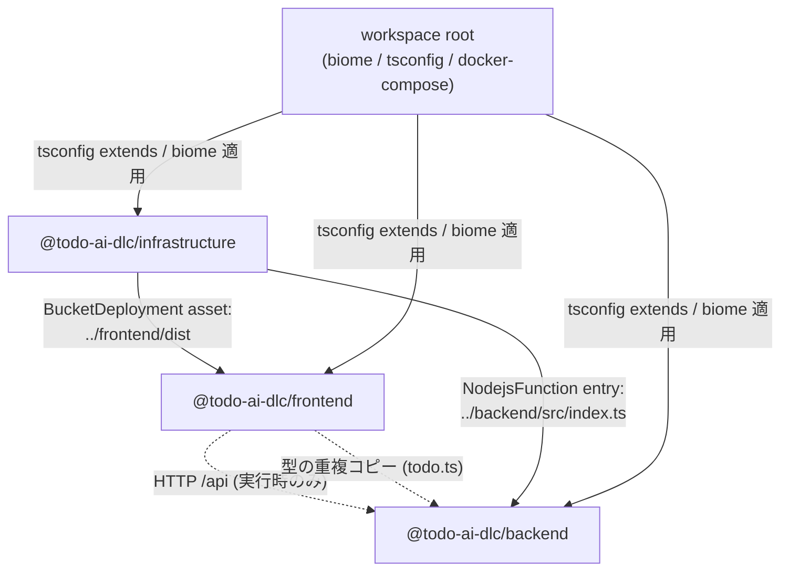

# Dependencies

> Stage: reverse-engineering / Owner: aidlc-systems-architect-agent
> バージョン表記: 宣言（package.json）→ 解決（pnpm-lock.yaml）。

## Internal Dependency Graph

pnpm workspace 上の 3 パッケージ間に `workspace:` プロトコルによる**パッケージ依存は存在しない**。結合はすべて「パスまたはプロトコル」レベルで発生している。

### Dependency Details

| Source | Target | Type | Reason |
|---|---|---|---|
| frontend | backend | Runtime（HTTP のみ） | `todoApi` が `/api/todos` を fetch。コンパイル時依存なし。コントラクトは重複定義された型（CS-O1）で暗黙合意 |
| infrastructure | backend | Build（相対パス） | `NodejsFunction` の `entry` が `packages/backend/src/index.ts` を直接参照し esbuild バンドル。backend の依存解決に infrastructure 側の synth が引きずられる |
| infrastructure | frontend | Deploy（相対パス） | `BucketDeployment` が `packages/frontend/dist` を参照。**frontend を build してからでないと synth/deploy が失敗する**（暗黙のビルド順序） |
| 全パッケージ | root | Build | ルート tsconfig を extends、Biome 設定・pnpm-lock を共有 |

## External Dependencies

### Runtime Dependencies

| Dependency | Version | Purpose | Licence | Maintenance |
|---|---|---|---|---|
| hono | ^4.6.0 → 4.12.7 | backend Web フレームワーク | MIT | active |
| @aws-sdk/client-dynamodb | ^3.700.0 → 3.1007.0 | DynamoDB クライアント（Lambda では external 化 — TS-O3） | Apache-2.0 | active |
| @aws-sdk/lib-dynamodb | ^3.700.0 → 3.1007.0 | DocumentClient 抽象 | Apache-2.0 | active |
| zod | ^3.24.0 → 3.25.76 | 入力検証 | MIT | active（ただし v3 系。現行は v4 — TS-O2） |
| ulid | ^2.3.0 → 2.4.0 | ID 生成 | MIT | 更新頻度低（仕様が安定しているため実害小） |
| react / react-dom | ^19.0.0 → 19.2.x | UI ライブラリ | MIT | active |
| aws-cdk-lib | 2.177.0（固定） | IaC ライブラリ | Apache-2.0 | active（ただし固定版が 2025-01 で停滞 — TS-O2） |
| constructs | ^10.4.0 → 10.5.1 | CDK construct 基盤 | Apache-2.0 | active |

### Dev Dependencies

| Dependency | Version | Purpose |
|---|---|---|
| @biomejs/biome | 1.9.4（root） | lint / format / import 整理 |
| typescript | ^5.7.0 → 5.9.3（各パッケージ） | 型検査 |
| vitest | ^2.1.0 → 2.1.9（各パッケージ） | テストランナー |
| @hono/node-server | ^1.13.0 → 1.19.11 | backend ローカル実行 |
| @types/aws-lambda | ^8.10.0 | Lambda 型定義 |
| tsx | ^4.19.0 → 4.21.0 | TS 直接実行（backend dev / CDK app） |
| vite / @vitejs/plugin-react / @tailwindcss/vite | ^6.0.0 / ^4.3.0 / ^4.0.0 | frontend ビルドチェーン |
| tailwindcss | ^4.0.0 → 4.2.1 | スタイリング |
| @testing-library/react / jest-dom | ^16.1.0 / ^6.6.0 | コンポーネントテスト |
| jsdom | ^25.0.0 → 25.0.1 | テスト DOM 環境 |
| @types/react / @types/react-dom | ^19.0.0 | React 型定義 |
| aws-cdk | 2.177.0（固定） | CDK CLI |

## Dependency Risks

| Risk | Dependency | Impact | Mitigation |
|---|---|---|---|
| コントラクト乖離 | frontend ⇄ backend の重複型定義 | 片側の型変更が他方に伝播せず、実行時の形状不一致として顕在化（コンパイルでは検出不能） | 共有パッケージ化（DEP-P1） |
| 暗黙のビルド順序 | infrastructure → frontend/dist | `frontend build` 前の `cdk synth/deploy` が失敗。手順が README にも未記載 | デプロイスクリプト化（DEP-P2） |
| ソース直結バンドル | infrastructure → backend/src | backend の内部構造変更（entry 移動・依存追加）が infrastructure の synth を壊す。変更影響が package 境界を越える | 結合点の明文化 + CI で synth 検証（CS-P3） |
| バージョン停滞 | aws-cdk-lib 2.177.0 固定 | deprecation 警告（AR-O7）放置、新機能・修正を受けられない | 計画的更新（TS-P1） |
| メジャー遅れ | zod 3 / vitest 2 / vite 6 / biome 1.9 | 将来のセキュリティ修正・エコシステム互換から脱落していくリスク | 同上 + Renovate 導入（DEP-P3） |
| 実行時 SDK 不一致 | @aws-sdk/*（external 化） | ローカル/テストと Lambda 実行時で SDK バージョンが異なる潜在的挙動差 | 戦略の明文化（TS-P3） |
| lockfile 迂回 | Dockerfile.dev の `\|\| pnpm install` | lockfile 不整合時に非固定インストールへ黙ってフォールバック（SECURITY-10 の意図を弱める） | フォールバック撤去（CS-P5） |
| 監視不在 | 全依存 | CVE 監査の仕組みなし（`pnpm audit` の定期実行・CI 組込みなし） | CI に audit 追加（DEP-P3） |

---

## Observations（観測事項 — 事実の記録）

| # | 観測事項 | 根拠 |
|---|---|---|
| DEP-O1 | workspace 間の `workspace:` 依存はゼロ。frontend/backend の結合は「HTTP + 型の手動コピー」、infrastructure の結合は「相対パス参照」で成立している | 各 package.json、`lib/todo-stack.ts:33, 182` |
| DEP-O2 | `BucketDeployment` の `../frontend/dist` 参照により、**ビルド順序（frontend build → cdk deploy）が暗黙の前提**になっているが、この手順はリポジトリ内に文書化・スクリプト化されていない（README はローカル開発手順のみ） | `lib/todo-stack.ts:180-186`、README.md |
| DEP-O3 | 依存は本番 runtime 8 系統・dev 13 系統と小規模で、全て MIT/Apache-2.0。ライセンスリスクなし | 各 package.json、pnpm-lock.yaml |
| DEP-O4 | バージョン管理方針が CDK（固定）と他（caret）で非対称。v1 SECURITY-10 は「pnpm lock file, pinned CDK deps」とするので**実装は v1 設計どおり**（ドリフトではない） | `infrastructure/package.json` vs v1 infrastructure-design |
| DEP-O5 | 依存の脆弱性監査（pnpm audit / OSV 等）を実行する定常プロセス・CI が存在しない | リポジトリ全体（CI 不在 CS-O5 と同根） |

## Refactoring Proposals（リファクタリング提案 — 下流ステージの判断材料）

| # | 提案 | 対応する観測 | トレードオフ |
|---|---|---|---|
| DEP-P1 | `@todo-ai-dlc/shared` workspace パッケージを新設し、型 + zod schema + 制約定数を `workspace:` 依存で共有（CS-P1 と同一提案。依存グラフ上は fe→shared←be の星形になる） | DEP-O1 | 「HTTP のみの疎結合」という現在の純粋さは失われるが、コントラクト乖離リスクの解消が勝る規模 |
| DEP-P2 | デプロイ手順をスクリプト化（例: ルートに `deploy` script で `pnpm --filter frontend build && pnpm --filter infrastructure deploy`）し、暗黙のビルド順序を明示化 | DEP-O2 | 数行で済む。教材としても手順の自己文書化になる |
| DEP-P3 | Renovate/Dependabot + CI での `pnpm audit` 定期実行を導入し、依存更新と CVE 検知を継続プロセス化 | DEP-O5, TS-O2 | PR ノイズが増える。グループ化設定で緩和可能 |
